<p align="center"></p>

<h1 align="center">Darpan</h1>

<p align="center"><b>Stop paying for remote desktop.</b><br>
Use your Linux computer from your Mac or any browser. It feels local, stays private, and costs nothing.</p>

<p align="center"></p>

## Download

| Install on | Download | |
|---|---|---|
| **Linux**: the computer you connect **to** | [darpan_amd64.deb](../../releases/latest/download/darpan_amd64.deb) | Ubuntu 24.04 or similar |
| **Mac**: the computer you connect **from** | [Darpan.dmg](../../releases/latest/download/Darpan.dmg) | macOS 14 or later, Apple silicon or Intel |
| **Any browser** | no Darpan app; [Tailscale](https://tailscale.com/download) on that device | Chrome, Safari, Edge or Firefox |

All versions: [Releases](../../releases).

## Get started

**1. On the Linux computer**, install the package:

```bash
sudo apt install ~/Downloads/darpan_amd64.deb
```

Open **Darpan** from your apps. Click **Sign in** (a free [Tailscale](https://tailscale.com) account
with Google, GitHub, Microsoft or Apple), then **Publish**. Darpan shows you an **address** and a
**password**.

<a name="mac-app"></a>**2. On the Mac**, open `Darpan.dmg` and drag **Darpan** to Applications. Open it. If macOS won't open
it the first time, go to System Settings → Privacy & Security and click **Open Anyway**. Then click
**Sign in** with the same account.

**3. Connect.** Enter the address and password, and click **Connect**. That's it.

> **From a browser instead:** install [Tailscale](https://tailscale.com/download) on that device,
> sign in with the same account, and open the address. In Chrome, *Install Darpan* turns it into its own window.

## Why Darpan

| | |
|---|---|
| **Feels local** | About 27 ms from a change on the Linux screen to your Mac, over the internet. Typing and scrolling keep up. |
| **Private** | Only your own devices can reach it. The connection is encrypted end to end, no ports are opened, and on top of that there's a password that never crosses the network. |
| **Light** | On the Linux computer, nothing runs until you connect: 0 % CPU while idle, and about 0.3 % of one CPU core while you're connected. Your long GPU jobs keep the machine. |
| **Complete** | Sound, clipboard in both directions, drag-and-drop file transfer, screen resolution changes, full screen, and a toolbar that tucks away. |
| **Free** | Open source (MIT). No subscription, and no account with us. |

## Everyday use

* **Copy and paste** with ⌘C and ⌘V. The clipboard syncs both ways. In Linux terminals, ⌘ acts on the terminal
  (⌘C copies, ⌘V pastes, ⌘T opens a tab) and ⌃ goes to the shell (⌃C interrupts, ⌃R searches).
* **Sound** from the Linux computer plays on your Mac, or in the browser. The speaker button in the toolbar mutes it.
* **Send files** by dropping them on the window. They land in `~/Downloads/Darpan` on the Linux computer.
* **The toolbar** is the small tab at the top of the window. Hover over it for full screen, display and
  quality, keyboard, clipboard, files and sound. Drag it sideways if it's in the way.
* **Shortcuts**: ⌘ works as Ctrl on Linux, and other ⌘ shortcuts go to Linux too. Three stay on the Mac: ⌃⌥⌘F full
  screen, ⌃⌥⌘D disconnect, and ⌃⌥⌘⎋ to release the keyboard (press it again to capture). System shortcuts
  (⌘Tab, ⌘Space, Mission Control) stay on the Mac unless you turn on *Send ⌘Tab, ⌘Space…* in the
  toolbar's keyboard panel and allow Darpan under System Settings → Privacy & Security → Accessibility.

<details>
<summary><b>Requirements and limitations</b></summary>

* **Linux:** Ubuntu 24.04 (or similar) in an **X11 session**; on the login screen, choose
  *Ubuntu on Xorg*. Wayland isn't supported yet. Sound uses PipeWire, the default since Ubuntu 22.10.
  With an NVIDIA GPU, video is encoded in hardware;
  without one, Darpan falls back to software encoding, which uses several CPU cores while you're
  connected.
* **After a reboot**, someone has to log in on the Linux computer before Darpan can show its screen,
  unless automatic login is enabled.
* **Staying signed in:** Tailscale signs devices out after 180 days. To avoid that, open the
  [Tailscale admin console](https://login.tailscale.com/admin/machines) and choose
  **Disable key expiry** for the Linux computer and for Darpan on your Mac.
* **After an update**, macOS may ask once whether Darpan can use its saved sign-in. Choose **Always Allow**.

</details>

<details>
<summary><b>Command line (Linux)</b></summary>

```text
darpan status       address, password and connected devices
darpan password     show the password; --set to choose one, --generate for a new random one
darpan disconnect   end all remote sessions
darpan doctor       check the display, GPU encoder, network and service
darpan net          network status: direct connection or relayed
```

Logs: `journalctl --user -u darpan -u darpan-net -f`

</details>

<details>
<summary><b>Uninstall</b></summary>

```bash
sudo apt remove darpan
rm -rf ~/.config/darpan ~/.local/state/darpan ~/.local/share/darpan   # settings, password, network state
```

On the Mac, drag Darpan from Applications to the Trash, delete `~/Library/Application Support/Darpan`
(its network sign-in), and in Keychain Access delete the `dev.darpan.Darpan` items (saved sign-ins). Then remove both devices in the
[Tailscale admin console](https://login.tailscale.com/admin/machines).

</details>

<details>
<summary><b>How it works</b></summary>

* **Capture only what changes.** The host waits for X11 damage events; there's no capture timer. A
  changed frame is copied straight to the GPU and encoded with NVENC (H.264, ultra-low-latency) in
  about 5 ms.
* **No queues.** Each frame needs a credit, and the viewer returns one after decoding. A slow
  network means fewer frames, never a backlog. The pointer is drawn on your side, so it never lags.
* **A private network built in.** Both ends include an unprivileged [Tailscale](https://tailscale.com)
  node (WireGuard, peer-to-peer when possible). The host listens only on 127.0.0.1 and is published
  over HTTPS inside your tailnet. The password is checked by challenge–response, with lockouts.
* **Native decoding.** The Mac app decodes with VideoToolbox; browsers use WebCodecs.

The wire protocol is documented in [PROTOCOL.md](PROTOCOL.md).

</details>

<details>
<summary><b>For developers</b></summary>

```text
linux/             host: Python daemon, C capture/NVENC encoder, browser client, packaging, tests
mac/               native macOS client (Swift)
PROTOCOL.md        wire protocol: the contract every client implements
MAC_PROMPT.md      design brief for the macOS client
dev-messageboard/  asynchronous coordination between contributors
scripts/           repository maintenance
```

Build and test notes: [linux/README.md](linux/README.md), [mac/README.md](mac/README.md). Every change
goes through a pull request and a review. Before publishing a release, run
`scripts/check-private-data.sh`.

</details>

## License

[MIT](LICENSE)
