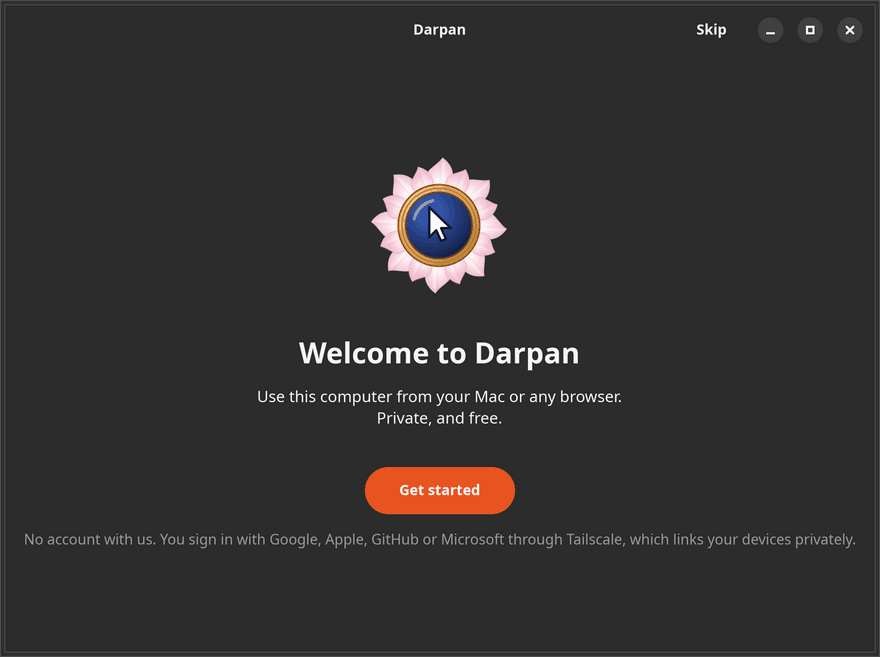
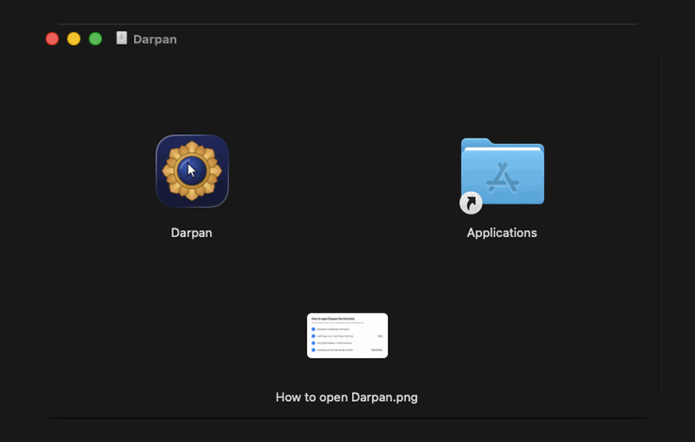

<p align="center"></p>

<h1 align="center">Darpan</h1>

<p align="center"><b>Stop paying for remote desktop.</b><br>
Darpan is a high-performance, lightweight remote desktop: use your Linux computer from a native
Mac app. It feels local and stays private.</p>

<p align="center"><b>Free and open source · No account with us · No subscription</b></p>

<p align="center">
<a href="LICENSE"></a>


</p>

<p align="center"></p>

## Get started

<table>
<tr>
<td width="50%" align="center" valign="top"><picture><source media="(prefers-reduced-motion: reduce)" srcset="docs/onboarding-linux.png"></picture><br><sub>On the Linux computer</sub></td>
<td width="50%" align="center" valign="top"><picture><source media="(prefers-reduced-motion: reduce)" srcset="docs/onboarding-mac.png"></picture><br><sub>On the Mac</sub></td>
</tr>
</table>

You sign in with the Google, Apple, GitHub or Microsoft account you already have, through
[Tailscale](https://tailscale.com)'s free private network, which is built in. There's no Darpan account,
no port forwarding and nothing to change on your router.

1. **On the Linux computer**, the one you connect to: download
   [darpan_amd64.deb](../../releases/latest/download/darpan_amd64.deb) and double-click it to install
   (or run `sudo apt install ~/Downloads/darpan_amd64.deb`). Open **Darpan** and click **Get started**.
   It shows you a password.
2. <a name="mac-app"></a>**On the Mac**, the one you connect from: download
   [Darpan.dmg](../../releases/latest/download/Darpan.dmg), drag Darpan to Applications and open it.
   The first time, macOS asks you to allow it under System Settings → Privacy & Security →
   **Open Anyway**, because Darpan isn't notarized by Apple.
3. **Connect:** sign in with the same account, click your Linux computer and enter its password.

**From a browser instead**, on any other computer: install [Tailscale](https://tailscale.com/download),
sign in with the same account, and open the address the Darpan window on Linux shows.

<sub>Linux: Ubuntu 24.04 or similar, in an X11 session. Mac: macOS 14 or later. Browsers: Chrome, Safari,
Edge or Firefox. All versions: [Releases](../../releases).</sub>

## Why Darpan

<table>
<tr>
<td width="33%" valign="top">
<p></p>
<p><b>Feels local</b><br>~20–30 ms screen to screen,<br>even Wi-Fi to Wi-Fi.<br><sub>&nbsp;</sub></p>
</td>
<td width="33%" valign="top">
<p></p>
<p><b>Private</b><br>Only your devices get in,<br>encrypted, no open ports.<br><sub>&nbsp;</sub></p>
</td>
<td width="33%" valign="top">
<p></p>
<p><b>Lightweight</b><br>Linux: 0 % CPU when idle,<br>about 5 % during a video.<br><sub>&nbsp;</sub></p>
</td>
</tr>
<tr>
<td valign="top">
<p></p>
<p><b>Sound</b><br>Whatever plays on the Linux<br>computer plays on your Mac.<br><sub>&nbsp;</sub></p>
</td>
<td valign="top">
<p></p>
<p><b>Copy and paste</b><br>⌘C and ⌘V work both ways,<br>in Linux terminals too.<br><sub>&nbsp;</sub></p>
</td>
<td valign="top">
<p></p>
<p><b>Files</b><br>Send and receive files,<br>or drop them on the window.<br><sub>&nbsp;</sub></p>
</td>
</tr>
<tr>
<td valign="top">
<p></p>
<p><b>Dictation</b><br>Talk, and the words land<br>at the Linux cursor.<br><sub>&nbsp;</sub></p>
</td>
<td valign="top">
<p></p>
<p><b>Your computers</b><br>Switch between Linux<br>computers with one click.<br><sub>&nbsp;</sub></p>
</td>
<td valign="top">
<p></p>
<p><b>Also in a browser</b><br>Away from your Mac? Open<br>it in any web browser.<br><sub>&nbsp;</sub></p>
</td>
</tr>
</table>

Plus full screen, screen resolutions to match your window, and a toolbar that tucks away.

## Performance

Measured on a Linux PC with an RTX 4090 at 2560×1440 (Darpan 1.4.1), viewed from a MacBook over
Wi-Fi (Darpan 1.4.0; its video path is the same in 1.4.1). CPU is a share of one core.

| | Linux computer | Mac app |
|---|---|---|
| Nobody connected | 0 % CPU, no GPU memory | — |
| Everyday use | 3 % CPU | 8–10 % CPU |
| Full-screen video with sound | 6 % CPU | 32 % CPU |
| Memory while connected | 40 MB of GPU memory | 50–90 MB (as Activity Monitor shows it) |

A frame reaches the Mac's screen about 27 ms after the Linux computer captures it, over Wi-Fi. Of
that, turning a change into a video frame takes the Linux computer 5 ms, and the Mac decodes it in
hardware in about 4 ms.

<details>
<summary><b>Everyday use</b></summary>

* **Copy and paste** with ⌘C and ⌘V. The clipboard syncs both ways. In Linux terminals (with ⌘ as Ctrl, the default), ⌘ acts on the terminal
  (⌘C copies, ⌘V pastes, ⌘T opens a tab) and ⌃ goes to the shell (⌃C interrupts, ⌃R searches).
* **Dictation** apps work in the Darpan window. With Wispr Flow, for example, you talk and the text
  lands at the Linux cursor, as if you had typed it.
* **Sound** from the Linux computer plays on your Mac, or in the browser. The speaker button in the toolbar mutes it.
* **Files**: **Files** in the toolbar opens two panes, this Mac and the Linux computer. Select files
  or folders and **Send** or **Receive** them, or drag between the panes. Files dropped on the window
  land on the Linux desktop. The browser has the same window, with the Linux side only.
* **After a restart**, Darpan can show the Linux login screen, so you log in from your Mac with
  nobody at the Linux computer. Turn on *Show the login screen* in the Darpan window, once.
* **Video**: *Balanced* suits most networks. At *Higher Quality* and *Max*, the Mac app gets full
  colour (4:4:4) on Macs that decode it in hardware, so coloured text such as code stays crisp. Turn on *Full GPU on the Linux computer*
  for the sharpest, fastest video, especially when scrolling fast; it uses about 280 MB of the Linux
  computer's GPU memory while you're connected, instead of about 40 MB.
* **Resolution**: pick one in the toolbar's display panel. The Linux computer remembers it, for the
  Mac app and for each browser, and switches back to it the next time you connect; *Native* goes back
  to normal.
* **The toolbar** is the small capsule at the upper right of the window. Point at it for full screen,
  display and quality, keyboard, files, stats and sound. Drag it by its grip to put it anywhere.
* **Shortcuts**: ⌘ works as Ctrl on Linux, and other ⌘ shortcuts go to Linux too. Three stay on the Mac: ⌃⌥⌘F full
  screen, ⌃⌥⌘D disconnect, and ⌃⌥⌘⎋ to release the keyboard (press it again to capture). System shortcuts
  (⌘Tab, ⌘Space, Mission Control) stay on the Mac unless you turn on *Send ⌘Tab, ⌘Space…* in the
  toolbar's keyboard panel and allow Darpan under System Settings → Privacy & Security → Accessibility.


</details>

<details>
<summary><b>Updates</b></summary>

* **Linux:** new versions arrive through Software Updater, or with one click in the Darpan window.
* **Mac:** Darpan checks for a new version once a day while it's open, and asks before installing. It's
  the only request Darpan makes outside your private network; turn it off with ⚙︎ → *Check for Updates
  Automatically*.

</details>

<details>
<summary><b>Requirements and limitations</b></summary>

* **Linux:** Ubuntu 24.04 (or similar) in an **X11 session**; on the login screen, choose
  *Ubuntu on Xorg*. Wayland isn't supported yet. Sound uses PipeWire, the default since Ubuntu 22.10.
  With an NVIDIA GPU, video is encoded in hardware;
  without one, Darpan falls back to software encoding, which uses several CPU cores while you're
  connected.
* **After a restart**, someone has to log in on the Linux computer before Darpan can show its screen,
  unless *Show the login screen* is on. Turning it on moves the login screen, and everyone's sessions,
  to Xorg, and lets every program running as you see and control the login screen, including what
  other people type there. On a computer other people use, leave it off.
* **Staying signed in:** Tailscale signs devices out after 180 days. To avoid that, open the
  [Tailscale admin console](https://login.tailscale.com/admin/machines) and choose
  **Disable key expiry** for the Linux computer and for Darpan on your Mac.
* **After an update**, macOS may ask once whether Darpan can use its saved sign-in. Choose **Always Allow**.

</details>

<details>
<summary><b>Command line (Linux)</b></summary>

```text
darpan status       address, password and connected devices
darpan password     show the password; --set to choose one, --generate for a new random one
darpan disconnect   end all remote sessions
darpan doctor       check the display, GPU encoder, network and service
darpan net          network status: direct connection or relayed
darpan login-screen after a restart, show the login screen: on or off
```

Logs: `journalctl --user -u darpan -u darpan-net -f`

</details>

<details>
<summary><b>Uninstall</b></summary>

```bash
sudo apt remove darpan
rm -rf ~/.config/darpan ~/.local/state/darpan ~/.local/share/darpan   # settings, password, network state
```

On the Mac, drag Darpan from Applications to the Trash, delete `~/Library/Application Support/Darpan`
(its network sign-in), and in Keychain Access delete the `dev.darpan.Darpan` items (saved sign-ins). Then remove both devices in the
[Tailscale admin console](https://login.tailscale.com/admin/machines).

</details>

<details>
<summary><b>How it works</b></summary>

* **Capture only what changes.** The host waits for X11 damage events; there's no capture timer. A
  changed frame goes straight to the GPU and is encoded by its video encoder (H.264, through Vulkan
  Video) in about 5 ms. That takes about 40 MB of GPU memory while you're connected, and none otherwise.
* **No queues.** Each frame needs a credit, and the viewer returns one after decoding. A slow
  network means fewer frames, never a backlog. The pointer is drawn on your side, so it never lags.
* **A private network built in.** Both ends include an unprivileged [Tailscale](https://tailscale.com)
  node (WireGuard, peer-to-peer when possible). The host listens only on 127.0.0.1 and is published
  over HTTPS inside your tailnet. The password is checked by challenge–response, with lockouts.
* **Native decoding.** The Mac app decodes with VideoToolbox; browsers use WebCodecs.

The wire protocol is documented in [PROTOCOL.md](PROTOCOL.md).

</details>

## Contributing

Darpan is open source, and contributions are welcome: bug reports, fixes, new clients and ideas.
[CONTRIBUTING.md](CONTRIBUTING.md) explains how to build it, run the tests and send a pull request.
Every client speaks the same documented [protocol](PROTOCOL.md), so a Windows or iPad client only
has to implement that.

## License

[MIT](LICENSE)
