<p align="center"></p>

<h1 align="center">Darpan</h1>

<p align="center"><b>Stop paying for remote desktop.</b><br>
Darpan is a free, open-source remote desktop for your Linux computer. Use it from your Mac or any
browser: it feels local and stays private.</p>

<p align="center">
<a href="LICENSE"></a>


</p>

<p align="center"></p>

## Download

**The only setup is a free [Tailscale](https://tailscale.com) account.** Darpan has it built in, so
there's no port forwarding and nothing to change on your router.

| Install on | Download | |
|---|---|---|
| **Linux**: the computer you connect **to** | [darpan_amd64.deb](../../releases/latest/download/darpan_amd64.deb) | Ubuntu 24.04 or similar |
| **Mac**: the computer you connect **from** | [Darpan.dmg](../../releases/latest/download/Darpan.dmg) | macOS 14 or later, Apple silicon or Intel |
| **Any browser** | no Darpan app; [Tailscale](https://tailscale.com/download) on that device | Chrome, Safari, Edge or Firefox |

All versions: [Releases](../../releases).

## Get started

**1. On the Linux computer**, install the package:

```bash
sudo apt install ~/Downloads/darpan_amd64.deb
```

Open **Darpan** from your apps. Click **Sign in** (a free [Tailscale](https://tailscale.com) account
with Google, GitHub, Microsoft or Apple), then **Publish**. Darpan shows you an **address** and a
**password**.

<a name="mac-app"></a>**2. On the Mac**, open `Darpan.dmg` and drag **Darpan** to Applications. Open it. If macOS won't open
it the first time, go to System Settings → Privacy & Security and click **Open Anyway**. Then click
**Sign in** with the same account.

**3. Connect.** Darpan lists your Linux computers. Click yours; the first time, enter the password
Darpan shows on it. That's it.

> **From a browser instead:** install [Tailscale](https://tailscale.com/download) on that device,
> sign in with the same account, and open the address. In Chrome, *Install Darpan* turns it into its own window.

## Why Darpan

<table>
<tr>
<td width="33%" valign="top">
<p></p>
<p><b>Feels local</b><br>~20–30 ms screen to screen,<br>even Wi-Fi to Wi-Fi.<br><sub>&nbsp;</sub></p>
</td>
<td width="33%" valign="top">
<p></p>
<p><b>Private</b><br>Only your devices get in,<br>encrypted, no open ports.<br><sub>&nbsp;</sub></p>
</td>
<td width="33%" valign="top">
<p></p>
<p><b>Lightweight</b><br>Linux: 0 % CPU when idle,<br>about 5 % during a video.<br><sub>&nbsp;</sub></p>
</td>
</tr>
<tr>
<td valign="top">
<p></p>
<p><b>Sound</b><br>Whatever plays on the Linux<br>computer plays on your Mac.<br><sub>&nbsp;</sub></p>
</td>
<td valign="top">
<p></p>
<p><b>Copy and paste</b><br>⌘C and ⌘V work both ways,<br>in Linux terminals too.<br><sub>&nbsp;</sub></p>
</td>
<td valign="top">
<p></p>
<p><b>Files</b><br>Drop a file on the window:<br>it lands on the desktop.<br><sub>&nbsp;</sub></p>
</td>
</tr>
<tr>
<td valign="top">
<p></p>
<p><b>Dictation</b><br>Talk, and the words land<br>at the Linux cursor.<br><sub>&nbsp;</sub></p>
</td>
<td valign="top">
<p></p>
<p><b>Your computers</b><br>Switch between Linux<br>computers with one click.<br><sub>&nbsp;</sub></p>
</td>
<td valign="top">
<p></p>
<p><b>Any browser</b><br>No app needed: open the<br>address in any browser.<br><sub>&nbsp;</sub></p>
</td>
</tr>
</table>

Plus full screen, screen resolutions to match your window, and a toolbar that tucks away.
**Free and open source** (MIT): no subscription, and no account with us.

## Everyday use

* **Copy and paste** with ⌘C and ⌘V. The clipboard syncs both ways. In Linux terminals (with ⌘ as Ctrl, the default), ⌘ acts on the terminal
  (⌘C copies, ⌘V pastes, ⌘T opens a tab) and ⌃ goes to the shell (⌃C interrupts, ⌃R searches).
* **Dictation** apps work in the Darpan window. With Wispr Flow, for example, you talk and the text
  lands at the Linux cursor, as if you had typed it.
* **Sound** from the Linux computer plays on your Mac, or in the browser. The speaker button in the toolbar mutes it.
* **Send files** by dropping them on the window. They land on the Linux computer's desktop. In the
  browser, **Files** in the toolbar browses the Linux computer: send files and folders into any folder,
  or select some and **Receive** them.
* **The toolbar** is the small capsule at the upper right of the window. Point at it for full screen,
  display and quality, keyboard, files, stats and sound. Drag it by its grip to put it anywhere.
* **Shortcuts**: ⌘ works as Ctrl on Linux, and other ⌘ shortcuts go to Linux too. Three stay on the Mac: ⌃⌥⌘F full
  screen, ⌃⌥⌘D disconnect, and ⌃⌥⌘⎋ to release the keyboard (press it again to capture). System shortcuts
  (⌘Tab, ⌘Space, Mission Control) stay on the Mac unless you turn on *Send ⌘Tab, ⌘Space…* in the
  toolbar's keyboard panel and allow Darpan under System Settings → Privacy & Security → Accessibility.

## Updates

* **Linux:** new versions arrive through Software Updater, like any other package.
* **Mac:** Darpan checks for a new version once a day while it's open, and asks before installing. It's
  the only request Darpan makes outside your private network; turn it off with ⚙︎ → *Check for Updates
  Automatically*.

<details>
<summary><b>Requirements and limitations</b></summary>

* **Linux:** Ubuntu 24.04 (or similar) in an **X11 session**; on the login screen, choose
  *Ubuntu on Xorg*. Wayland isn't supported yet. Sound uses PipeWire, the default since Ubuntu 22.10.
  With an NVIDIA GPU, video is encoded in hardware;
  without one, Darpan falls back to software encoding, which uses several CPU cores while you're
  connected.
* **After a reboot**, someone has to log in on the Linux computer before Darpan can show its screen,
  unless automatic login is enabled.
* **Staying signed in:** Tailscale signs devices out after 180 days. To avoid that, open the
  [Tailscale admin console](https://login.tailscale.com/admin/machines) and choose
  **Disable key expiry** for the Linux computer and for Darpan on your Mac.
* **After an update**, macOS may ask once whether Darpan can use its saved sign-in. Choose **Always Allow**.

</details>

<details>
<summary><b>Command line (Linux)</b></summary>

```text
darpan status       address, password and connected devices
darpan password     show the password; --set to choose one, --generate for a new random one
darpan disconnect   end all remote sessions
darpan doctor       check the display, GPU encoder, network and service
darpan net          network status: direct connection or relayed
```

Logs: `journalctl --user -u darpan -u darpan-net -f`

</details>

<details>
<summary><b>Uninstall</b></summary>

```bash
sudo apt remove darpan
rm -rf ~/.config/darpan ~/.local/state/darpan ~/.local/share/darpan   # settings, password, network state
```

On the Mac, drag Darpan from Applications to the Trash, delete `~/Library/Application Support/Darpan`
(its network sign-in), and in Keychain Access delete the `dev.darpan.Darpan` items (saved sign-ins). Then remove both devices in the
[Tailscale admin console](https://login.tailscale.com/admin/machines).

</details>

<details>
<summary><b>How it works</b></summary>

* **Capture only what changes.** The host waits for X11 damage events; there's no capture timer. A
  changed frame is copied straight to the GPU and encoded with NVENC (H.264, ultra-low-latency) in
  about 5 ms.
* **No queues.** Each frame needs a credit, and the viewer returns one after decoding. A slow
  network means fewer frames, never a backlog. The pointer is drawn on your side, so it never lags.
* **A private network built in.** Both ends include an unprivileged [Tailscale](https://tailscale.com)
  node (WireGuard, peer-to-peer when possible). The host listens only on 127.0.0.1 and is published
  over HTTPS inside your tailnet. The password is checked by challenge–response, with lockouts.
* **Native decoding.** The Mac app decodes with VideoToolbox; browsers use WebCodecs.

The wire protocol is documented in [PROTOCOL.md](PROTOCOL.md).

</details>

## Contributing

Darpan is open source, and contributions are welcome: bug reports, fixes, new clients and ideas.
[CONTRIBUTING.md](CONTRIBUTING.md) explains how to build it, run the tests and send a pull request.
Every client speaks the same documented [protocol](PROTOCOL.md), so a Windows or iPad client only
has to implement that.

## License

[MIT](LICENSE)
